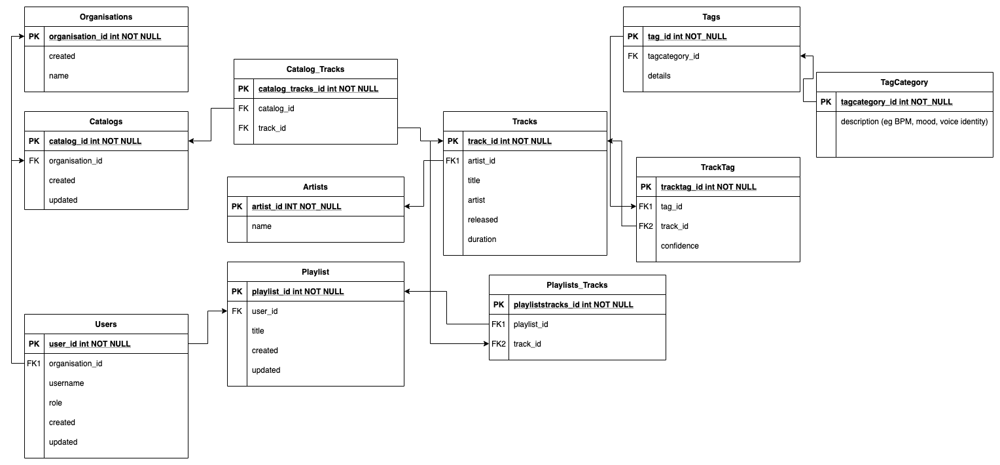

# About

Attempt to design a music app system

# Requirements
- Python
- Django
- Django Rest Frameowrk
- Optional: pipenv


# Admin Credentials

- Username: chelseaee
- Password: music4lyfe

# Available API routes

````
/tracks
/tracks?tag_id=<tag_id>
/tags
/catalogs
/organisations
/artists
/users
/playlists

````

# Design Constraints / Assumptions

Most frequently used search function = search tracks by tags-> way to index this?
Also tracks from user’s organisation’s catalog 

## CATALOG
- Each organisation has only one catalog (OneToOne)
- Should be able to see when track was added to catalog (e.g. for companies who are keeping track of music they have limited licences for, this could prove useful)

## TRACKS
- Can have multiple artists
- Can be up to hours (ambient background music)
- Have many tags
- Should be able to sort by date of release (so day and month need to be taken into account)
- Users would want to sorttracks by artist, duration, tags
- Tracks do not belong to any organisation


## PLAYLISTS
- Can be empty
- Should only contain tracks from the user’s organisation’s catalog

## Users
- User can only add tracks to their playlists from their organisation’s catalog
- Admin users are the only ones who can add songs to the organisation catalog

## TagCategory
- Predefined
- Categories include BPM, mood, voice identity, genre

## Tags 
- Predefined
- Associated with a TagCategory
- Contains values specific to category (eg 90-105 BPM, female, jazz)
- Each tag should only have one tag with the category BPM, one under voice identity, mood and genre could have multiples 
- For tags under BPM, it should only be an integer (regex?)


# Notes
- Regretfully, I wasn't able to fully implement all constraints (e.g. users should be restricted to adding tracks only from their organisation's catalog)
- Probably shouldn't have used Django as I am still unfamiliar with it -- had difficulty with doing RESTful API routes, ended up using query params
- Should have used django user auth models, could have been easier to restrict access to catalogs


